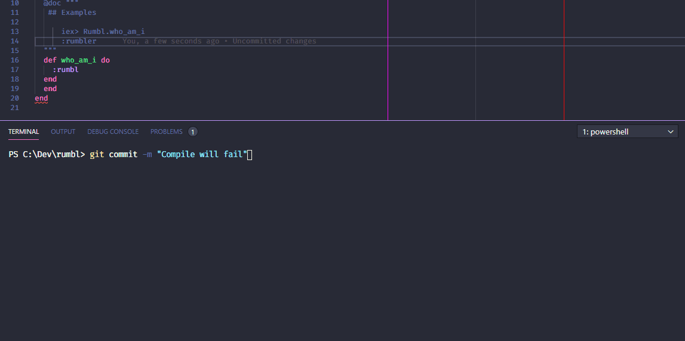

# How to Hook ⚓

## 1. Clone this repository.
## 2. Remember to have elixir installed and the path environment variable set ⚗
## 3. Run the command below to point to this repository path on each of the repositories you want to use this commit rules:
    $ ./you-elixir-mix-repository> git config core.hooksPath "../hook-potion" --replace-all
### or if you have git all or pgitall:
    $ gitall . 'git config core.hooksPath "../hook-potion" --replace-all'
## 4. Test if is working:
* Make a change on the repository 
* Try to Commit with a compilation error/warning
* Error should be throw and you should not be able to commit.

## 🎉🎉🎉🎉 Thats It Enjoy !  🎉🎉🎉🎉

# Hook Potion in action 🧪

